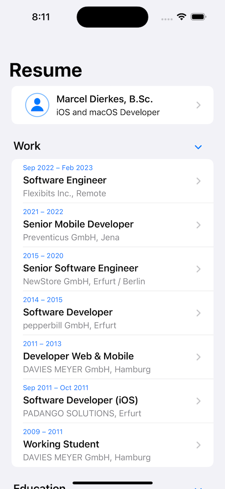

# Resume

This repository contains my resume as an iOS app.

This app was built in Swift using a mix of UIKit and SwiftUI and requires iOS <= 16.0. The actual resume data is fetched at runtime.

Find out more at [marcel-dierkes.info/cv](https://marcel-dierkes.info/cv/).

## Build Instructions

- open `Arcwind.xcworkspace`
- build and run the `Arcwind` app target

## License

Proprietary
